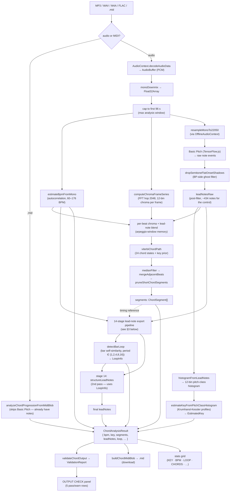

# Chord Detector — End-to-End Pipeline

What happens to an audio file from the moment it hits the chord-detector page to the
moment the user clicks "Export MIDI". Use this as the map when deciding where a new
step belongs.

## 1. Big picture (audio in → MIDI out)

## 2. Stages of the audio path, at a glance

| # | Stage | Module | Input | Output | What it does | Why it's there |
|---|---|---|---|---|---|---|
| A | Decode | (browser) | `Blob` | `AudioBuffer` | Decodes the file format to PCM | Need raw samples |
| B | Mono downmix | `mixing-audio-analysis` | stereo PCM | mono `Float32Array` | Averages L/R | Single-channel for analysis |
| C | Cap to 96 s | engine | mono | trimmed mono | `mono.subarray(0, 96·sr)` | Bound runtime + memory |
| D | BPM estimate | `mixing-audio-analysis` | mono | `bpm: number` | Autocorrelation on the energy envelope, lag → BPM | Drives beat grid, quantize grid, loop bars |
| E | Chromagram | `mixing-audio-key-estimate` | mono | per-frame 12-bin chroma | FFT @ 4096 / hop 2048, fold to pitch classes | Harmonic backbone for chord decode |
| F | Resample → 22.05 kHz | `chord-detector-basic-pitch` | mono | mono @ 22050 | Basic Pitch's required sample rate | Model input |
| G | Basic Pitch (TF.js) | `@spotify/basic-pitch` | mono @ 22050 | raw note events | CNN polyphonic transcription | Get notes from audio |
| H | Ghost-shadow filter | `chord-detector-basic-pitch` | raw notes | `leadNotesRaw` | Drops short notes with a longer +1-semitone parent | Kill BP's onset-transient artifacts |
| I | Histogram + Key | `chord-detector-basic-pitch` + engine | `leadNotesRaw` | `pitchClassHistogram`, `EstimatedKey` | Duration×velocity histogram → KK Pearson corr | Tonality readout |
| J | Per-beat blend → Viterbi | engine | chroma + `leadNotesRaw` + BPM | `segments` | Beat-windowed chroma + lead PCs → 24-state Viterbi → median/merge | Chord progression |
| K | 14-stage export | engine + `chord-detector-melody` + `chord-detector-structure` | `leadNotesRaw`, BPM, RMS curve | clean `leadNotes` | See §3 | Turn BP's noisy poly notes into a clean MIDI export |
| L | Loop detect | `chord-detector-loops` | final `leadNotes`, BPM | `LoopInfo` | Bar-fingerprint self-similarity | Stat readout + Stage 14 seam-trim |
| M | Validate | `chord-detector-validation` | full result | `ValidationReport` | 5 heuristic pass/warn checks | "OUTPUT CHECK" panel |
| N | MIDI export | engine | `leadNotes`, `bpm` | `Blob (audio/midi)` | `new Midi()` + `addNote` per lead note | Download button |

## 3. The 14-stage lead-note export pipeline

This is the heart of the export. **Stages 1–13 = Part 2** (the bug-fix pipeline);
**stage 14 = Part 3** (the new structuring pass).

```mermaid
flowchart LR
    RAW["leadNotesRaw<br/>458 → ghost filter → 434"] --> S1
    S1["1 · mergeAdjacentSamePitchNotes<br/>(42 ms)"] --> S2
    S2["2 · collapseOctaveDuplicatesNearOnsets<br/>(42 ms)"] --> S3
    S3["3 · dropSimultaneousPitchOutliers (pass 1)"] --> S4
    S4["4 · thinPolyphonicLeadNotesByTimeWindow<br/>(cap = 4, keeps top voice)"] --> S5
    S5["5 · debounceIsolatedBassBlips"] --> S6
    S6["6 · dropLowRegisterNotesShorterThan"] --> S7
    S7["7 · dropLeadNotesShorterThan"] --> S8
    S8["8 · refineLeadNotesForMidiExport<br/>(RMS-flux sustain tails)"] --> S9
    S9["9 · applyNeuralNoteStyleLeadNotes<br/>(phase-aware quantize → 1/16 + 1/16-T)"] --> S10
    S10["10 · alignChordOnsetsInLeadNotes"] --> S11
    S11["11 · dropSimultaneousPitchOutliers (pass 2)"] --> S12
    S12["12 · enforceTwoHandPianoPolyphony<br/>(maxAbove=4, keeps top + bass)"] --> S13
    S13["13 · mergeAdjacentSamePitchNotes<br/>(final merge — Part 2 Bug 4)"] --> S14
    S14["14 · structureLeadNotes<br/>① re-snap to 1/16/1/16-T<br/>② quantize lengths to 1/16 multiples<br/>③ seam-trim across loop boundaries<br/>④ merge touching same-pitch pairs<br/>← Part 3"] --> OUT
    OUT["final leadNotes<br/>354 notes (control MP3)"]
```

### Per-stage attrition (control MP3)

| Stage | Notes out | Δ | What it removes |
|---|---:|---:|---|
| −1 BP true raw | 458 | — | — |
| 0  ghost filter | 434 | −24 | semitone-flat onset shadows (e.g. 20× F4 under F♯4) |
| 1  merge | 379 | −55 | adjacent same-pitch fragments (≤ 42 ms gap) |
| 2  octave collapse | 364 | −15 | quieter half of an octave-class onset pair |
| 3–7  outliers / thin / debounce / drop | 364 | 0 | (nothing on this clip; arpeggiated → sparse clusters) |
| 8  RMS refine | 364 | 0 | only re-timings, no drops |
| 9  quantize | 364 | 0 | re-snaps **starts** to musical grid |
| 10 onset-align | 364 | 0 | nudges chord-cluster onsets |
| 11 outliers pass 2 | 364 | 0 | — |
| 12 two-hand cap | 364 | 0 | (would drop, but max poly is 7 — caps don't fire) |
| 13 final merge | 359 | −5 | sub-grid same-pitch fragments created by stages 8–10 |
| **14 structure (Part 3)** | **354** | **−5** | touching same-pitch pairs created by length-quantize |

## 4. Key parameters per stage (tunables, in one place)

| Where | Knob | Value | What it controls |
|---|---|---|---|
| Basic Pitch | `noteSensitivity` | 0.565 | Frame threshold (1 − sensitivity) |
| Basic Pitch | `splitSensitivity` | 0.12 | Onset threshold (1 − sensitivity); low = ghost suppression |
| Basic Pitch | `minNoteDurationMs` | 205 | Pre-merge note-length floor |
| Ghost filter | `MAX_GHOST_SEC` | 0.52 | Short-note cutoff |
| Ghost filter | `NEAR_SEC` | 0.10 | Gap tolerance to a +1-semitone parent |
| Stage 1, 13 | `samePitchMaxGapSec` | 0.042 | Same-pitch merge threshold |
| Stage 9 | `timeDivisionIndex` | 1/16 | Primary quantize grid (sibling 1/16-T always considered) |
| Stage 9 | `quantizeForce` | 1.0 | Full snap |
| Stage 12 | `maxAbove` / `maxBelow` | 4 / 4 | Per-hand polyphony cap |
| Stage 14 | `durationGridSixteenths` | 1 | Length quantize step |
| Stage 14 | `seamTrimToleranceSixteenths` | 1 | Allowed seam straddle |
| Stage 14 | `postQuantizeMergeGapSec` | 0.045 | Final touching-pair merge |
| Chord decode | `exoticQualityPenalty` | 0.14 | sus4/aug/dim emission penalty |
| Chord decode | `decay` (arp window) | 0.45 | Previous-bar memory weight |
| Loop | `LOOP_SIM_THRESHOLD` | 0.7 | Min mean bar Jaccard to count |
| Validation | `onGridTolMs` | 10 | "On the grid" tolerance |
| Validation | `dupGapSec` | 0.045 | Same-pitch duplicate window |

## 5. The validation panel (5 checks)

| id | label | passes when |
|---|---|---|
| `timing` | Timing & note lengths | ≥ 95 % of notes have starts **and** lengths on 1/16 or 1/16-T grid |
| `duplicates` | No split or duplicate notes | 0 same-pitch pairs with gap ≤ 45 ms |
| `loopSeam` | Loop seam | no note rings > 1/16 past its loop-unit boundary (n/a → pass when no loop) |
| `coverage` | Note coverage | density ∈ [0.5, 20] notes/s **and** no silent gap > 2 bars |
| `confidence` | Analysis confidence | `estimatedKey.confidence ≥ 0.6` |

## 6. Where a new step could plausibly go

Likely useful insertion points, with rationale:

```mermaid
flowchart LR
    P1["A · pre-emphasis<br/>(audio level, before BP)"] -. tried + reverted .- BPstage
    BPstage["Basic Pitch"] --> ghost
    ghost["ghost filter"] --> P2
    P2["B · velocity normalize<br/>before stage 1"] --> stages1to12
    stages1to12["stages 1–12"] --> P3
    P3["C · per-pitch RMS revisit<br/>after onset-align"] --> S13
    S13["13 · merge"] --> S14
    S14["14 · structure"] --> P4
    P4["D · post-structure consensus<br/>across loop repeats"] --> EXPORT
    EXPORT["MIDI export"]
```

- **A — pre-emphasis** (lift highs before BP): *tried in Part 2, reverted as negative
  result.* Doesn't help on bright-but-rolled-off sources; would only matter for very
  bass-heavy material. Don't try again without different data.
- **B — velocity normalization** (between ghost filter and stage 1): would normalize
  BP's amplitude-derived velocities to a musical curve. Useful if exports sound
  velocity-flat to a sampler.
- **C — per-pitch RMS revisit** (between stage 10 and 13): re-check note ends against
  RMS after onset-align nudges; might recover sustain that align trims. Risk: re-creates
  splits that 13's merge then has to clean up.
- **D — loop-consensus consolidation** (after stage 14): the path the user explicitly
  *rejected* in Part 3 (the "consolidate to one clean loop" alternative). Still on the
  shelf if "clean every repetition in place" stops being enough.

Any new step that **rearranges note timing** should run **before** stage 9 (so the
quantize is the source of truth) **or** be its own structuring pass that mirrors what
stage 14 does (re-snap → length-quantize → merge), so the invariant "starts AND lengths
are on the 1/16 grid" holds at the output.

Any new step that **drops or adds notes** should run **before** stage 12 (so the two-
hand cap can still preserve melody+bass) and **before** stage 13 (so the final merge
cleans whatever sub-grid pairs it creates).
